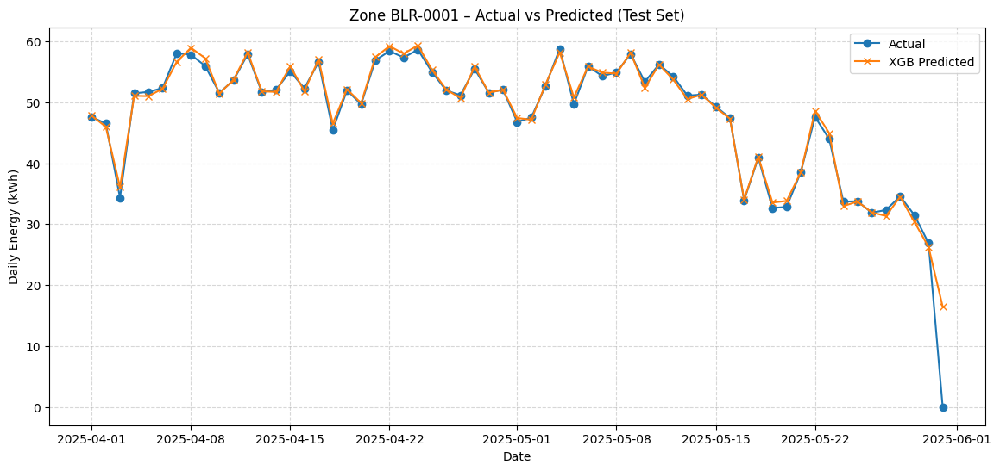

# Bengaluru Renewable Energy Forecasting System

## Project Overview
This project builds a **location-agnostic solar forecasting and suitability mapping system** for Bengaluru.  
It predicts **daily solar energy output** using NASA POWER data and machine learning models (XGBoost, Ridge), while also mapping **zone-level suitability** for solar installations.  

The final deliverable is a **Streamlit dashboard** that allows users to:
- View solar suitability across Bengaluru zones.
- Check the solar potential of their own home by entering coordinates.
- Download full zone-level datasets for further analysis.

---

## Features in Streamlit App
- **Interactive Suitability Map**  
  Displays Bengaluru divided into 223 zones, colored by solar suitability (score 0–100 or annual kWh).
- **Top 10 Zones**  
  Automatically ranks the best-performing zones by score or annual kWh.
- **Home Check Tool**  
  Lets users check solar feasibility at their location (manual coordinates or geolocation).
- **Download Data**  
  Option to download the full CSV file of all zone-level predictions.
---

## Model Accuracy (XGBoost Example)

Below is an example for **Zone BLR-0001** showing **Actual vs Predicted Daily Energy** using the **XGBoost model** on the test set:



---

## Implementation Steps (Phase 1 → Phase 7)

### **Phase 1 — Data Collection**
- Fetch daily solar irradiance and climate variables from **NASA POWER API**.
- Store raw CSV/Parquet files in `/data/raw/`.

### **Phase 2 — Data Preprocessing**
- Clean missing values, normalize metrics.
- Engineer features (temperature, irradiance, wind speed).
- Store processed files in `/data/processed/`.

### **Phase 3 — Feature Engineering**
- Create lag features (moving averages of irradiance/temperature).
- Encode seasonal/time-of-year effects.
- Split into train/test sets.

### **Phase 4 — Model Training**
- Train **Ridge Regression** and **XGBoost Regressor** models.
- Evaluate using RMSE, MAE, R².
- Save models to `/models/`.

### **Phase 5 — Zone-Level Aggregation**
- Map Bengaluru into 223 geographic zones (GeoJSON).
- Aggregate predicted annual kWh and normalize into scores (0–100).
- Save as `suitability_solar_geo.parquet`.

### **Phase 6 — Visualization & Mapping**
- Build **GeoPandas + PyDeck layers** for interactive visualization.
- Generate zone-level suitability map.

### **Phase 7 — Streamlit Dashboard**
- Create final interactive app (`app/streamlit_app.py`):
  - Tabs: Suitability Map & Home Check
  - Top 10 Zones table
  - Full CSV download option
  - Home feasibility calculator with estimated annual energy

---

## How to Run Locally
1. Clone this repository:
   ```bash
   git clone https://github.com/jaidevreddy/blr-renewables.git
   cd blr-renewables
2. pip install -r requirements.txt
3. streamlit run app/streamlit_app.py

---

## Data Source
All climate and irradiance data used in this project comes from:  
**[NASA POWER Project](https://power.larc.nasa.gov/)** - thank you NASA


